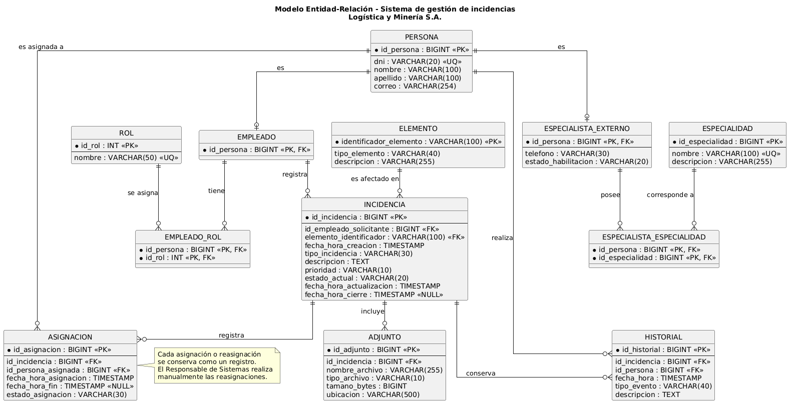

# Modelo Entidad-Relación

## Diagrama

[Ver código PlantUML](../diagramas/er.puml)

## Entidades

| Entidad | Descripción | Relaciones clave |
|---------|-------------|------------------|
| PERSONA | Almacena los datos básicos de las personas registradas en el sistema. | Es la entidad principal de EMPLEADO y ESPECIALISTA_EXTERNO. |
| EMPLEADO | Representa a una persona que trabaja en la empresa. | Su `id_persona` es PK y FK a PERSONA. Se relaciona con ROL mediante EMPLEADO_ROL y puede registrar incidencias. |
| ESPECIALISTA_EXTERNO | Representa a una persona que presta servicios externos. | Su `id_persona` es PK y FK a PERSONA. Se relaciona con ESPECIALIDAD mediante ESPECIALISTA_ESPECIALIDAD. |
| ROL | Catálogo de roles habilitados en el sistema. | Se relaciona con EMPLEADO mediante EMPLEADO_ROL. |
| EMPLEADO_ROL | Resuelve la relación de muchos a muchos entre EMPLEADO y ROL. | Tiene una PK compuesta por `id_persona` e `id_rol`; ambos campos son también FK. |
| ESPECIALIDAD | Catálogo de especialidades técnicas. | Se relaciona con ESPECIALISTA_EXTERNO mediante ESPECIALISTA_ESPECIALIDAD. |
| ESPECIALISTA_ESPECIALIDAD | Resuelve la relación de muchos a muchos entre ESPECIALISTA_EXTERNO y ESPECIALIDAD. | Tiene una PK compuesta por `id_persona` e `id_especialidad`; ambos campos son también FK. |
| ELEMENTO | Catálogo de equipos, dispositivos, vehículos o aplicaciones que pueden asociarse a una incidencia. | Puede estar relacionado con varias incidencias a lo largo del tiempo. |
| INCIDENCIA | Registra el problema o solicitud desde su creación hasta su cierre. | Se relaciona con el EMPLEADO solicitante, el ELEMENTO afectado, sus adjuntos, el historial y las asignaciones. |
| ADJUNTO | Almacena la referencia a una imagen asociada a una incidencia. | Pertenece a una INCIDENCIA. |
| HISTORIAL | Registra los eventos y las intervenciones vinculados a una incidencia. | Se relaciona con una INCIDENCIA y con la PERSONA que realizó la acción. |
| ASIGNACION | Registra las asignaciones y reasignaciones de una incidencia. | Se relaciona con una INCIDENCIA y con la PERSONA asignada. |

## Descripción de atributos principales

Los tipos de datos indicados son genéricos y no dependen de un motor de base de datos específico.

### PERSONA

- `id_persona` (BIGINT, PK): identificador único de la persona.
- `dni` (VARCHAR(20), UQ): documento de identidad; no se puede repetir.
- `nombre` (VARCHAR(100)): nombre de la persona.
- `apellido` (VARCHAR(100)): apellido de la persona.
- `correo` (VARCHAR(254)): correo electrónico de contacto.

### EMPLEADO

- `id_persona` (BIGINT, PK y FK): identifica al empleado y lo vincula con PERSONA.

### ESPECIALISTA_EXTERNO

- `id_persona` (BIGINT, PK y FK): identifica al especialista y lo vincula con PERSONA.
- `telefono` (VARCHAR(30)): número de contacto del especialista.
- `estado_habilitacion` (VARCHAR(20)): indica si el especialista está Habilitado o Revocado.

### ROL

- `id_rol` (INT, PK): identificador único del rol.
- `nombre` (VARCHAR(50), UQ): nombre del rol, que no se puede repetir.

### EMPLEADO_ROL

- `id_persona` (BIGINT, PK y FK): empleado al que se le asigna el rol.
- `id_rol` (INT, PK y FK): rol asignado al empleado.

La PK es compuesta por `id_persona` e `id_rol`.

### ESPECIALIDAD

- `id_especialidad` (BIGINT, PK): identificador único de la especialidad.
- `nombre` (VARCHAR(100), UQ): nombre de la especialidad.
- `descripcion` (VARCHAR(255)): descripción breve de la especialidad.

### ESPECIALISTA_ESPECIALIDAD

- `id_persona` (BIGINT, PK y FK): especialista vinculado.
- `id_especialidad` (BIGINT, PK y FK): especialidad asignada.

La PK es compuesta por `id_persona` e `id_especialidad`.

### ELEMENTO

- `identificador_elemento` (VARCHAR(100), PK): identificador del equipo, dispositivo, vehículo o aplicación.
- `tipo_elemento` (VARCHAR(40)): tipo de elemento; por ejemplo, equipo informático, dispositivo móvil, vehículo o software/aplicación.
- `descripcion` (VARCHAR(255)): descripción o nombre del elemento.

### INCIDENCIA

- `id_incidencia` (BIGINT, PK): identificador único de la incidencia.
- `id_empleado_solicitante` (BIGINT, FK a EMPLEADO): empleado que registró la incidencia.
- `elemento_identificador` (VARCHAR(100), FK a ELEMENTO): elemento afectado.
- `fecha_hora_creacion` (TIMESTAMP): fecha y hora de registro.
- `tipo_incidencia` (VARCHAR(30)): falla técnica o solicitud técnica.
- `descripcion` (TEXT): detalle del problema o necesidad.
- `prioridad` (VARCHAR(10)): prioridad seleccionada; Baja, Media, Alta o Vital.
- `estado_actual` (VARCHAR(20)): estado vigente: Nuevo, En curso, Pendiente, Resuelto o Cerrado.
- `fecha_hora_actualizacion` (TIMESTAMP): fecha y hora de la última actualización.
- `fecha_hora_cierre` (TIMESTAMP, NULL): fecha y hora de cierre; queda vacía mientras la incidencia no esté cerrada.

### ADJUNTO

- `id_adjunto` (BIGINT, PK): identificador único del archivo.
- `id_incidencia` (BIGINT, FK a INCIDENCIA): incidencia a la que pertenece la imagen.
- `nombre_archivo` (VARCHAR(255)): nombre del archivo.
- `tipo_archivo` (VARCHAR(10)): formato de la imagen; PNG o JPEG.
- `tamano_bytes` (BIGINT): tamaño del archivo en bytes; no debe superar los 15 MB.
- `ubicacion` (VARCHAR(500)): ruta o referencia para recuperar la imagen.

### HISTORIAL

- `id_historial` (BIGINT, PK): identificador único del evento.
- `id_incidencia` (BIGINT, FK a INCIDENCIA): incidencia relacionada con el evento.
- `id_persona` (BIGINT, FK a PERSONA): persona que realizó la acción.
- `fecha_hora` (TIMESTAMP): momento en que ocurrió el evento.
- `tipo_evento` (VARCHAR(40)): tipo de evento; por ejemplo, cambio de estado, asignación, aviso de imposibilidad de atención, acción realizada, diagnóstico, avance, solución propuesta o resolución final.
- `descripcion` (TEXT): detalle del evento o de la intervención.

### ASIGNACION

- `id_asignacion` (BIGINT, PK): identificador único de la asignación.
- `id_incidencia` (BIGINT, FK a INCIDENCIA): incidencia asignada.
- `id_persona_asignada` (BIGINT, FK a PERSONA): persona responsable de atenderla.
- `fecha_hora_asignacion` (TIMESTAMP): momento en que se realizó la asignación.
- `fecha_hora_fin` (TIMESTAMP, NULL): momento en que finalizó esa asignación; queda vacío mientras siga vigente.
- `estado_asignacion` (VARCHAR(30)): estado de la asignación: Vigente, Pendiente de reasignación o Finalizada.

## Decisiones de diseño

### Decisión 1 — Permitir varias especialidades por especialista externo

Un Especialista Externo puede tener varias especialidades, y una misma especialidad puede corresponder a varios especialistas. Por eso, la relación entre ESPECIALISTA_EXTERNO y ESPECIALIDAD es muchos a muchos y se resuelve mediante ESPECIALISTA_ESPECIALIDAD. Su clave primaria compuesta por `id_persona` e `id_especialidad` evita repetir la misma asociación. Se descarta guardar una sola `id_especialidad` en ESPECIALISTA_EXTERNO porque limitaría cada especialista a una especialidad.

### Decisión 2 — Registrar los eventos de la incidencia en HISTORIAL

HISTORIAL conserva los cambios y las intervenciones realizadas durante la gestión, incluyendo quién actuó y cuándo. La INCIDENCIA mantiene su `estado_actual` para consultar rápidamente el estado vigente. La resolución final también se registra en HISTORIAL, evitando duplicar su descripción en INCIDENCIA.

### Decisión 3 — Conservar las asignaciones y permitir la reasignación manual

Cada asignación o reasignación genera un registro en ASIGNACION. Si un Especialista Externo informa que no puede atender una incidencia, la asignación queda marcada como Pendiente de reasignación. El sistema no elige automáticamente a otro responsable; el Responsable de Sistemas realiza la reasignación. Se conserva el historial de asignaciones para saber quién estuvo a cargo en cada período.
